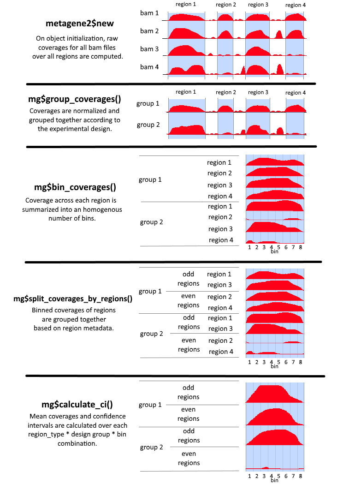

```{r style, echo = FALSE, results = 'asis', message = FALSE}
BiocStyle::markdown()
library(knitr)
```

**Package**: `r Biocpkg("metagene2")`<br />
**Modified**: April 2nd, 2019<br />
**Compiled**: `r date()`<br />
**License**: `r packageDescription("metagene2")[["License"]]`<br />

# Introduction

This package produces metagene plots, which aggregate coverages from
multiple sources (bam files) over multiple regions (genes, cofactor binding
sites, etc.) to provide profiles of average coverage. They are useful for
many different purposes, such as comparing the binding profiles of
DNA-interacting proteins at selected groups of features. In a typical analysis,
these features will be the transcription start sites (TSS) of genes, 
transcription factor binding sites, or enhancer regions. Multiple combinations
of groups of features and/or groups of bam files can be compared in a single analysis.
The metagene2 package uses bootstrap analysis to provide an estimation
of the mean enrichment and a confidence interval for each group of samples.

This vignette will introduce the main features of the metagene2 package. You can load 
the metagene2 package by calling `library(metagene2)`:

```{r libraryLoad, message = FALSE}
library(metagene2)
```

# Creating a metagene object

`metagene2` objects are used to perform all of the analysis steps necessary
to produce metagene plots. Calling `metagene2$new` creates a `metagene2` object and requires only two 
mandatory parameters: `bam_files`, which is the list of bam files from which
coverages should be extracted, and `regions`, which is the list of regions
over which said coverages are computed. We also recommend using the optional 
`assay` parameter, which can be one of `'chipseq'` or `'rnaseq'`, and will
automatically set other optional parameters to convenient defaults.
We discuss each of these arguments below.

```{r minimalAnalysis}
# metagene objects are created by calling metagene2$new and providing
# regions and bam files:
mg <- metagene2$new(regions = get_demo_regions(), 
                   bam_files = get_demo_bam_files(), 
                   assay='chipseq')

# We can then plot coverage over those regions across all bam files.
mg$produce_metagene(title = "Demo metagene plot")
```

## Specifying alignment files (BAM files)

There is no hard limit on the number of BAM files that can be included in an
analysis. However, loading a large number of bam files might also require large amounts
of memory. The provided bam files must be indexed: a file named `file.bam`,
must have an accompanying `file.bam.bai` or `file.bai` in its directory.

The paths (relative or absolute) to the BAM files must be provided in a vector.
If the vector is named, then those names will be used to refer to the bam files
in subsequent steps. Otherwise, `metagene2` will attempt to generate appropriate
names.

```{r bamFiles_show}
# We create a vector with paths to the bam files of interest.
bam_files <- get_demo_bam_files()
basename(bam_files)
```

Each bam file must have a corresponding index file:
```{r bamFiles_bai}
# List .bai matching our specified bam files.
basename(Sys.glob(gsub(".bam", ".ba*", bam_files)))
```

If no names were provided for the bam files, metagene automatically 
generates some:
```{r bamFiles_autoname}
mg <- metagene2$new(regions = get_demo_regions(), bam_files = bam_files)
names(mg$get_params()[["bam_files"]])
```

We also could have explicitly named our bam files.
```{r bamFiles_explicitname}
names(bam_files) = c("a1_1", "a1_2", "a2_1", "a2_2", "ctrl")
mg <- metagene2$new(regions = get_demo_regions(), bam_files = bam_files)
names(mg$get_params()[["bam_files"]])
```

## Specifying genomic regions

The regions for the metagene analysis can be provided in one of three different formats:

* A `character` vector, containing the paths to bed, narrowPeak, broadPeak or gtf
  files describing the regions to be used.
* A `GRanges` or `GRangesList` object defining a set of  contiguous regions.
* A `GRangesList` where each element defines a set of regions to be stitched 
  together to be considered as a single logical region.

### Defining regions using BED, narrowPeak, broadPeak and GTF files

`metagene2` can automatically import your regions of interest if they are already 
defined in a file with one of the following formats:

* [bed](https://genome.ucsc.edu/FAQ/FAQformat.html#format1)
* [narrowPeak](https://genome.ucsc.edu/FAQ/FAQformat.html#format12)
* [broadPeak](https://genome.ucsc.edu/FAQ/FAQformat.html#format13)
* [gtf](https://genome.ucsc.edu/FAQ/FAQformat.html#format4)

A file's extension will usually reflect the format it is stored in.

```{r regionsArgumentFilename}
regions <- get_demo_region_filenames()
regions
```

By providing those two file names to `metagene2$new`, they will be loaded 
and converted into appropriate objects:
```{r regionsArgumentFilenameLoad}
mg <- metagene2$new(regions = get_demo_region_filenames(),
                   bam_files = get_demo_bam_files())
mg$get_regions()
```

### Defining contiguous regions using GRanges or GRangesList objects

As an alternative to a list of BED files, `GRanges` objects can be used
to define contiguous regions of interest. Each range defined within the `GRanges`
object is treated separately from the others. `GRangesList` objects
are also accepted, but they are automatically coerced into `GRanges`
objects, and a column named `region_name` bearing the name of the list elements
is added to the coerced `GRanges`. Here is an example of valid regions
provided as a `GRangesList`:

```{r grangeslist_chipseq_regions}
regions <- get_demo_regions()
regions
```

When loaded by `metagene2`, they are converted to a `GRanges`:
```{r grangeslist_chipseq_load}
mg <- metagene2$new(regions = regions,
                   bam_files = get_demo_bam_files())
mg$get_regions()
```

Some common ranges that can be useful for plotting include the set of all TSSes
or gene bodies. While metagene2 does not provide those, they can easily be 
generated using packages from BioConductor:

```{r genratePromoterGRange, eval=FALSE}
    # First locate the TxDb package containing the geneset of interest.
    # Some of the most common TxDb packages include:
    #  - TxDb.Hsapiens.UCSC.hg38.knownGene
    #  - TxDb.Hsapiens.UCSC.hg19.knownGene
    #  - TxDb.Mmusculus.UCSC.mm10.knownGene
    #  - TxDb.Mmusculus.UCSC.mm10.ensGene
    library(TxDb.Hsapiens.UCSC.hg38.knownGene)
    
    # We'll use the GenomicFeatures package to obtain gene/TSS coordinates
    # from the TxDb package.
    library(GenomicFeatures)
    
    # The GenomicFeatures::genes function provides us with gene bodies.
    all_gene_bodies = GenomicFeatures::genes(TxDb.Hsapiens.UCSC.hg38.knownGene)
    
    # The GenomicFeatures::promoters function gets a region flanking the TSS.
    # By using it directly on TxDb.Hsapiens.UCSC.hg38.knownGene, we would get
    # the TSSes of all transcripts. Here, we use it on the gene_bodies GRanges
    # we've just created, and limit ourselves to one TSS per gene.
    all_TSS = GenomicFeatures::promoters(all_gene_bodies,
                                         upstream=2000, downstream=2000)
```

For more details about each datasets, please refer to their documentation 
(i.e.:`?promoters_hg19`).

### GRangesList objects for stitching ranges together

For certain types of analyses, it is useful to stitch together several 
regions into one logical unit. This is the case in RNA-seq data, where
exons are individual regions which make more sense when grouped together
into a single transcript.

For these cases, `regions` can be a `GRangesList` object where each element
is one such logical region. One must also specify the `region_mode="stitch"`
parameter when creating the new metagene object. When `assay='rnaseq'`, 
`region_mode` is automatically set to `"stitch"`.

```{r demo_rna_regions}
regions <- get_demo_rna_regions()
regions
```

In stitch mode, the loaded regions remain in a `GRangesList`, rather than being coerced
into a `GRanges`.
```{r demo_stitch_mode}
mg <- metagene2$new(regions = regions,
                   bam_files = get_demo_rna_bam_files(),
                   region_mode="stitch")
mg$get_regions()
```

# Grouping regions and bam files

By default, `metagene2` aggregates all passed-in regions together, and treats all
bam files separately. However, most non-trivial analyses will benefit from more
granularity. Bam files can be split among different ChIP-seq experiments and/or
multiple replicates. Regions can likewise be split according to multiple criteria: 
is the underlying gene up- or down-regulated? Is the enhancer bound by a cofactor
of interest? Below, we discuss how `metagene2` allows the user to specify those
groupings to produce relevant analyses.

## Grouping bam files
### Using an experimental design
In `metagene2`, an experimental design is a set of design groups, each of which
is defined as a set of "input" bam files and a set of "control" bam files.
There is no limit to the number of design groups, though a large number of
design groups will require a proportionately large amount of memory. A 
BAM file can be assigned to more than one design group.

The experimental design is expressed using a data-frame, where each row represents
a bam file. The very first column of the data-frame must identify the bam files,
using either their paths or their names as specified in the `bam_files` argument.
Each subsequent column then represents an individual design group. The column name
defines the design group's name, and the column values determine how each bam file
relates to the design group:
    + 0: ignore file
    + 1: input
    + 2: control

A design group does not need to have a control, but it must have at least
one input.    
    
```{r design_definition}
example_design <- data.frame(Samples = bam_files,
                             align1 = c(1,1,0,0,2),
                             align2 = c(0,0,1,1,2))
kable(example_design)
```
```{r design_plot}
# Initializing the metagene object.
mg <- metagene2$new(regions = get_demo_regions(),
                   bam_files = get_demo_bam_files(),
                   assay='chipseq')

# Plotting while grouping the bam files by design group
mg$produce_metagene(design=example_design)
```    

### Using design metadata
Grouping bam files using an experimental design aggregates all of 
their coverages together, flattening them into a single mean value
and its accompanying confidence interval. In some cases, it might be 
preferable to keep all experimental replicates separate, and plot
them next to each other to assess experimental reproducibility.

`metagene2` allows you to specify metadata to accompany your experimental
design, and then allows you to plot your data accordingly:

```{r design_metadata}
# Initializing the metagene object.
mg <- metagene2$new(regions = get_demo_regions(),
                   bam_files = get_demo_bam_files()[1:4],
                   assay='chipseq')

design_meta = data.frame(design=mg$get_design_group_names(),
                         Align=c("Align1", "Align1", "Align2", "Align2"),
                         Rep=c(1, 2, 1, 2))
                             
mg$produce_metagene(design_metadata=design_meta, facet_by=Align~Rep, group_by="region")
```

## Grouping regions
The descriptive power of metagenes stem from their ability to succintly summarize
coverage over groups of regions with shared characteristics. The `metagene2` package 
provides two options for grouping regions together: explicit grouping using a GRangesList
object, or grouping using metadata.

### Grouping regions using a GRangesList
When working with separate, contiguous regions, the most straightforward way of 
grouping regions together is to pass a GRangesList instead of a GRanges to metagene2$new.
Each element of the list then becomes a group of region that metagene aggregates together.
The same behaviour is obtained if regions are specified through file names rather
than GRanges objects.

```{r group_region_grangeslist}
# Create a GRangesList of regions to be grouped together.
regions_grl <- get_demo_regions()

# We now have a named GRangesList with two set of 50 regions.
regions_grl
lapply(regions_grl, length)

# Initializing the metagene object.
mg <- metagene2$new(regions = regions_grl,
                   bam_files = get_demo_bam_files(),
                   assay='chipseq')

# When plotting the final metagene, our regions are grouped according to
# their membership in the initial GRangesList object.
mg$plot(facet_by=~region, group_by="design")
```

### Grouping regions using metadata
A more powerful and flexible way of grouping regions is providing region
metadata. This is done by using the region_metadata parameter, which must
be a data-frame with as many rows as there are regions and columns that 
can be converted to factors. Once metadata has been attached to regions,
they can be grouped using the split_by parameter, which must be a
vector of column names from the region_metadata parameter.

By default, if no region_metadata is specified, `metagene2` looks for the mcols
attribute of the `regions` parameter if it is a `GRanges` object, or the first 
line of each individual mcols if it is a `GRangesList` object.

```{r group_region_metadata}
# First, we load the regions.
regions_gr <- unlist(get_demo_regions())

# We then define some metadata.
# The examples here are nonsensical. Real metadata could include factor
# binding status, differential expression, etc.
demo_metadata = data.frame(BedName=names(regions_gr),
                           EvenStart=ifelse((start(regions_gr) %% 2) == 0, "Even", "Odd"),
                           Strand=strand(regions_gr))
head(demo_metadata)

# Initializing the metagene object, passing in region metadata.
mg <- metagene2$new(regions = get_demo_regions(),
                   region_metadata=demo_metadata,
                   bam_files = get_demo_bam_files(),
                   assay='chipseq')

# When plotting the metagene, our regions are grouped according to
# the specified metadata columns.
mg$produce_metagene(split_by=c("EvenStart", "Strand"), facet_by=EvenStart~Strand, group_by="design")
```

# Intermediary processing steps and further parameters

A full metagene analysis consists of several steps, each of which
produces an intermediary result of interest. Calling the `new` and 
`produce_metagene` methods automatically perform all of those steps 
sequentially. However, if a full analysis is not required, it is also 
possible to carry these out one by one. When calling any step of the chain,
all previous steps are automatically carried out if they hadn't previously been.
The following schema illustrates those intermediate steps and results:


## Arguments, results caching and chaining

Objects of the `metagene2` class are "pipeline" objects, whose primary purpose
is to chain together the various steps required to produce a metagene plot
and manage the parameters required to do so. As such, metagene maintains
an internal list of all analytical parameters, which can be obtained by calling
`get_params()`:

```{r getParams}
mg <- get_demo_metagene()
names(mg$get_params())

mg$get_params()[["bin_count"]]
```

Any of these parameters can be set when calling `metagene2$new` or `produce_metagene`.
```{r setParamsConstructor}
mg <- metagene2$new(regions=get_demo_regions(), 
                   bam_files=get_demo_bam_files(),
                   bin_count=50)
mg$produce_metagene(alpha=0.01, title="Set parameters on produce_metagene")
```

These parameter values can be overwritten in further calls to produce_metagene.
All parameters for metagene's intermediary steps default to NA, which means 
"keep the previous value for this parameter".
When metagene detects that a parameter has changed, it invalidates only the 
necessary caches, and updates the parameter value in its internal list.

In the following example, we regenerate the previous metagene object by changing 
the number of bins. Genome-wide coverages are not computed again, and our previous 
alpha value and title remain the same.

```{r changeSingleParamProduceMetagene}
mg$produce_metagene(bin_count=100)
```

Below, we provide a short explanation of all of the above steps, as well as
a brief description of their most commonly used parameters. You can refer to 
each function's formal documentation in the `metagene2` manual for more details.

## `metagene2$new`
Initializing the metagene object calculates genome wide coverages for all 
bam files, and performs some preprocessing on the regions of interest.
* **regions**: Use this argument to specify which regions the metagene must be 
               computed over. See section 2.2, "Specifying genomic regions". 

* **bam_files**: Use this argument to specify which bam_files contain sample 
                 information. See section 2.1, "Specifying alignment files".

* **assay**: You can use this as a shorthand for specifying sensible defaults 
             for analysis parameters based on the type of experiment. You can 
             use "chipseq" for a strand agnostic experiment using contiguous
             regions, or "rnaseq" for a strand-specific experiment where
             regions are stitched exons.

* **region_mode**:Set the way the regions parameter is interpreted. Can be 
                  'separate', 'stitch' or 'auto'. See section 2.2, 
                  "Specifying regions".

* **padding_size**: The regions defined in `regions` will be padded by this 
    many nucleotides at both ends.
    
* **cores**: By passing an integer (the number of cores to use) or a 
    `BiocParallelParam` object, this argument allows metagene to run certain 
    operations in parallel.
    
* **paired_end**: Setting this to true indicates that your bam files containing
    paired_end data.
 
* **strand_specific**: Set this to TRUE if you want reads on the opposite strand
    to be discarded when calculating coverages.
    
* **paired_end_strand_mode**: When `strand_specific` is TRUE, this flag determines
    how read orientation should be interpreted. See the documentation for 
    `GenomicAlignments:::readGAlignmentPairs` for the possible values.

* **region_metadata**: Use this to specify metadata about your regions. It must
                       have as many rows as you have regions. You can then use
                       the columns therein for the `split_by` (in `mg$split_coverages_by_regions`),
                       `group_by` and `facet_by` (in `mg$plot()`) parameters.

* **extend_reads**: When calculating coverages, reads will be extended as if they 
                    were this long. In single-end chip-seq experiments, the captured
                    fragments are usually longer than their sequenced reads.
                    This option allows for "restoring" those fragments, and
                    provides smoother coverages.

* **invert_strand**: Set this to TRUE to invert strands when computing coverages.
                     thisis useful when dealing with single-end stranded RNA-seq,
                     which is often based cDNA rather than mRNAs.

## `group_coverages`

This function groups bam file coverages into design group coverages, and performs
normalization and noise removal when requested.

* **design**: The design explains how bam files are grouped together into logical
              design groups. See section 3.1, "Grouping bam files". By default,
              each bam file is in its own design group.
* **normalization**: This parameter determines how the coverages are normalized. 
   There are three possible values: "RPM" (Reads per million), "NCIS" (See
   Liand and Keles 2012) or NULL (No normalization).
* **design_filter**: You can exclude certain design groups from further processing
                     by filtering them. This is useful if you want to quickly 
                     recalculate certain values without processing every single 
                     bam file.

## `bin_coverages`
* **bin_count**: Determines the number of bins regions will be divided into.
                 `bin_count` cannot be smaller than the size of your smallest region.
* **region_filter**: You can exclude certain regions from further processing
                     by filtering them. This is useful if you want to quickly 
                     recalculate certain values without processing every single 
                     region.

## `split_coverages_by_regions`

This function splits the coverage matrices into submatrices where all regions
have identical metadata.

* **split_by**: This parameter is used to group together regions with similar 
                metadata. See section 3.2.2, "Grouping regions using metadata".

## `calculate_ci`

`calculate_ci` calculates coverage means across all (regions * design group * bin) 
combinations. It also estimates a confidence interval for those coverages,
using a resampling strategy.

* **alpha**: The alpha parameter for the confidence interval calculations.
* **sample_count**: The number of resampling to be performed.
* **resampling_strategy**: The resampling strategy to be used when performing the
                           bootstrap analysis, which can be either 'profile'
                           or 'bin'. In 'profile' mode, whole profiles
                           across all bins are resampled. In 'bin' mode,
                           each bin is resampled individually and independantly 
                           from all others.

## `add_metadata`

`add_metadata` takes the data-frame produced by `calculate_ci`and adds region
and design metadata to it so it can be more easily plotted.

* **design_metadata**: A data-frame providing metadata about the design groups.

## `plot`

During this step, metagene will use the `data.frame` provided by àdd_metadata` 
to plot the calculated values using `ggplot2`. 

* **title**: A title for the plot.
* **x_label**: = An x label for the plot.
* **facet_by**:+- A faceting formula.
* **group_by**: Which metadata column should we use for determining the
                color scale?
                        
```{r showPlot}
mg$plot(title = "Demo plot subset")
```

# Manipulating the `metagene2` objects

## Getters

Multiple getters functions are available to access the data that is stored in a
`metagene2` object. Here we present the most relevant ones.

### `get_params`

`metagene2` keeps a list of all analysis parameters used to generate its plots
and data structures. This list is initialized with reasonable defaults within the
on metagene constructor, and is updated whenever a new parameter is specified in 
`produce_metagene`, or any of the sub-processing steps (`group_coverages`, 
`bin_coverages`, etc.). This list can be accessed with the `get_params` function.

Most sub-processing steps accept NAs for their arguments' values: in those cases,
metagene reuses the last specified value for this parameter, or a default
one if the parameter has yet to be defined by the user.

```{r getParams2}
mg <- get_demo_metagene()
names(mg$get_params())

mg$get_params()[c("bin_count", "alpha", "design")]
```


### `get_bam_count`

To get the number of aligned reads in a BAM file, you can use the 
`get_bam_count` function:
```{r getBamCount}
mg <- get_demo_metagene()
mg$get_bam_count(mg$get_params()[["bam_files"]][1])
```

### `get_regions`

The `get_regions` function returns the post-processed regions that 
`metagene2` uses internally:

```{r getRegions}
# Out demo regions are a GRangesList of two elements containing 50 ranges each.
get_demo_regions()

# When we initialize the metagene object, thsoe regions will be pre-processed,
# flattening the list into a single GRanges object and adding a region_name`
# column for tracking.
mg <- metagene2$new(regions = get_demo_regions(),
                   bam_files = get_demo_bam_files())

# get_regions allows us to see those post-processed regions.
mg$get_regions()
```

### `get_raw_coverages`

To get the coverages produced during the initialization of the `metagene2`
object, you can use the `get_raw_coverages` function. Please note that to save
memory, metagene will only extract the coverages in the selected regions.

```{r getRawCoverages}
coverages <- mg$get_raw_coverages()
coverages[[1]]
length(coverages)
```

### `get_normalized_coverages`

The `get_normalized_coverages` function works exactly like the
`get_raw_coverages` function except that it returns the coverages in read per
million aligned (RPM).

## `clone`

To copy a metagene object, you have to use the `clone` function. Note that
certain elements of a metagene object are environments, and will be shared
amongst metagene objects unless `deep=TRUE` is specified.

```{r copyMetagene}
mg_copy <- mg$clone(deep=TRUE)
```

# Managing large datasets

While `metagene2` tries to reduce its memory usage, it is possible to run into
memory limits when working with multiple large datasets (especially when there
is a lot of regions with a large width).

One way to avoid this is to analyse each dataset seperately,  then merge the
resulting data-frames using `rbind` before passing them to passing them to the
`plot_metagene` function:

```{r plotMetagene}
mg1 <- metagene2$new(bam_files = get_demo_bam_files(), 
                     regions = get_demo_regions()[1])
mg2 <- metagene2$new(bam_files = get_demo_bam_files(),
                     regions = get_demo_regions()[2])
plot_metagene(rbind(mg1$add_metadata(), mg2$add_metadata()),
              facet_by=.~region_name)
```